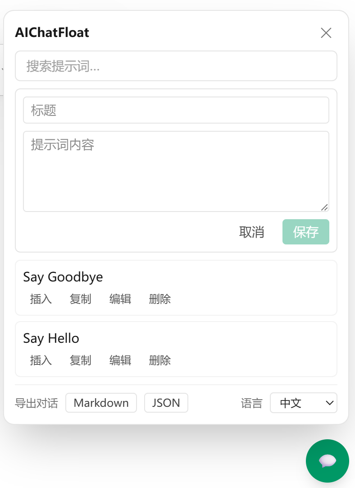
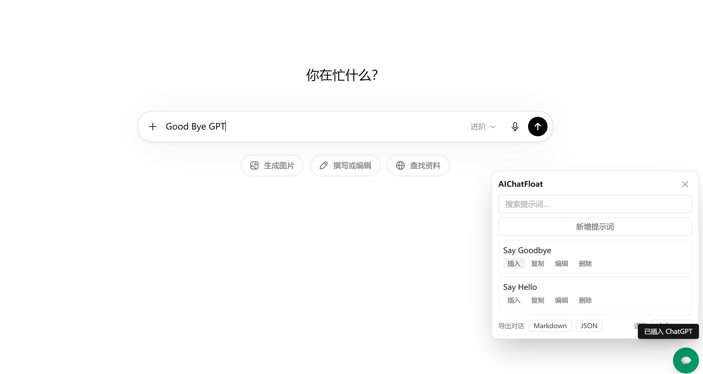

# AIChatFloat

[English](./README.md) | 中文

[](./LICENSE)
[](https://github.com/FrankJunhaoYe/AIChatFloat/actions/workflows/ci.yml)

一个悬浮在 **chatgpt.com** 右侧的侧边栏，帮你管理提示词、导出对话 —— 全部在浏览器本地完成。

## 功能

- **保存与管理提示词** —— 建立你自己的可复用提示词库。
- **即时搜索** 提示词。
- **一键复制** 提示词到剪贴板。
- **一键插入** 提示词到 ChatGPT 输入框。
- **导出**当前对话为 **Markdown** 或 **JSON**。
- **双语界面** —— English / 中文，应用内可切换（默认跟随浏览器语言）。

## 截图



保存、搜索、管理提示词；一键复制 / 插入；将对话导出为 Markdown 或 JSON。



一键把提示词插入到 ChatGPT 输入框。

## 隐私

AIChatFloat 是**纯前端**：无服务器、无账号、无 API 密钥，且**从不调用任何 AI 接口**。提示词只保存在浏览器本地存储（`chrome.storage.local`）。所谓“AI”就是你正在使用的 ChatGPT 页面本身。

## 安装（源码构建）

> 商店上架：_即将推出。_

```bash
git clone https://github.com/FrankJunhaoYe/AIChatFloat.git
cd AIChatFloat
npm install
npm run build
```

然后加载未打包扩展：

1. 打开 `chrome://extensions`。
2. 开启**开发者模式**。
3. 点击**加载已解压的扩展程序**，选择 `.output/chrome-mv3`。
4. 打开 <https://chatgpt.com>，右下角会出现一个悬浮的 💬 按钮。

## 使用

- 点 **💬** 打开面板。
- **Add prompt** 新增提示词；每条提示词可 **插入 / 复制 / 编辑 / 删除**。
- 用 **Export conversation → Markdown / JSON** 下载当前对话。
- 在 **Settings** 里切换语言。

## 开发

```bash
npm run dev          # WXT 开发服务器（Chrome，热重载）
npm run compile      # 类型检查（tsc --noEmit）
npm run test:run     # 单元测试（Vitest）
npm run test:e2e     # 对本地 mock 页跑 Playwright E2E（有头）
npm run build        # 生产构建 -> .output/chrome-mv3
npm run zip          # 打包以提交商店
```

## 技术栈

WXT · React 19 · TypeScript · Tailwind CSS v4 · react-i18next · Vitest · Playwright。

## 安全

运行时依赖（`react`、`react-dom`、`i18next`、`react-i18next`）无已知漏洞（`npm audit --omit=dev`）。`npm audit` 残留的告警均位于开发/构建工具链，**不会**打包进扩展。

## 项目状态

这是免费开源的 **v1**，刻意只支持 chatgpt.com、仅本地存储。未来的付费功能（云同步、多站点、高级导出）不在本仓库范围内，架构只为其预留干净的扩展点。

## 许可

[MIT](./LICENSE) © FranklyBuilds
